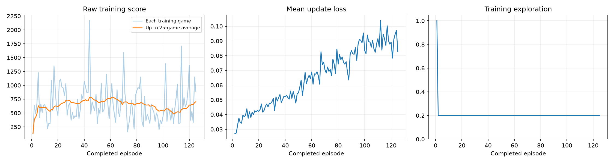
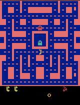

# Ms. Pac-Man DQN assignment

## Experiment overview

This project trains a Deep Q-Network (DQN) agent to play `ALE/MsPacman-v5` from game pixels. The final notebook was executed locally from top to bottom on an Apple Silicon Mac using PyTorch's MPS backend. It contains the untrained baseline evaluation, all 125 training episodes, periodic demonstrations, the final five-game evaluation, plots, logs, GIFs, and result-saving output.

Under the official matched-seed evaluation, the mean increased from **492** before training to **742** after training: **+250 points**, or about **+50.8%**. Four of the five paired games improved. This is evidence for this run and evaluation sample, not a guarantee of general performance.

## Final run summary

| Item | Actual final-run value |
|---|---:|
| Exploration | `0.20` |
| Episodes requested and completed | `125` |
| Learning rate | `0.00005` |
| Agent decisions | `76,129` |
| Learning updates | `18,783` |
| Recorded training and periodic-demo time | `222.543527 seconds` (`3m 42.5s`) |
| Learning device | Apple MPS |
| Hardware | Apple M5 MacBook Air, 10 cores, 32 GB memory |
| Operating system | macOS 26.6.2, arm64 |
| Python | 3.13.15 |
| Environment | `ALE/MsPacman-v5` |

The elapsed time comes directly from `training_summary.json`. It covers training and periodic demonstrations; the notebook separately ran the five baseline and five final evaluation games.

The submitted final run completed normally and was not interrupted; it performed 18,783 learning updates.

## Hyperparameters, search, and prediction

The final choices are:

- `EXPLORATION = 0.20`
- `EPISODES = 125`
- `LEARNING_RATE = 0.00005`

I first changed one variable at a time in short screens, then tested three promising combinations for 125 episodes. Every run began with a fresh untrained model and replay memory. The fixed evaluation seeds, evaluation exploration, maximum steps, network, and other classroom settings remained unchanged.

| Experiment | Exploration | Episodes | Learning rate | Trained mean | Baseline mean | Change | Updates | Time (s) |
|---|---:|---:|---:|---:|---:|---:|---:|---:|
| Previous submission | 0.20 | 100 | 0.00010 | 734 | 492 | +242 | 15,736 | 216.783 |
| Budget screen | 0.20 | 25 | 0.00010 | 336 | 492 | -156 | 3,569 | 42.429 |
| 50-episode control | 0.20 | 50 | 0.00010 | 330 | 492 | -162 | 7,564 | 89.592 |
| Exploration 0.10 screen | 0.10 | 50 | 0.00010 | 514 | 492 | +22 | 7,199 | 92.529 |
| Exploration 0.30 screen | 0.30 | 50 | 0.00010 | 260 | 492 | -232 | 7,189 | 82.449 |
| Learning rate 0.00005 screen | 0.20 | 50 | 0.00005 | 470 | 492 | -22 | 7,747 | 93.075 |
| Learning rate 0.00020 screen | 0.20 | 50 | 0.00020 | 218 | 492 | -274 | 7,504 | 87.859 |
| Exploration 0.10 candidate | 0.10 | 125 | 0.00010 | 476 | 492 | -16 | 18,902 | 228.938 |
| Learning rate 0.00005 candidate | 0.20 | 125 | 0.00005 | 742 | 492 | +250 | 18,783 | 234.767 |
| Combined candidate | 0.10 | 125 | 0.00005 | 504 | 492 | +12 | 18,437 | 243.627 |
| **Fresh final verification** | **0.20** | **125** | **0.00005** | **742** | **492** | **+250** | **18,783** | **222.544** |

Before the selected run, I expected the lower learning rate to make weight updates steadier and the extra 25 episodes to compensate for slower learning, while 20% exploration continued sampling alternative actions. The 0.20/125/0.00005 candidate had the strongest mean and much less five-game variability than the other full candidates, and a completely fresh verification run reproduced its five scores.

## What the agent sees, does, and receives

The agent observes a stack of **four grayscale 84 × 84 screens**. One screen describes positions; four consecutive screens also provide motion information.

At each decision, the network chooses one of nine Atari joystick actions: no-op, up, right, left, down, or one of four diagonal directions. Atari preprocessing advances four emulator frames per decision.

The environment returns a game reward after each action. Replay memory stores that reward clipped to the range -1 to +1 for training, while training logs and evaluations report the original, unclipped Ms. Pac-Man score.

## How DQN learns

The convolutional DQN estimates a future-reward value, or Q-value, for every action. After 1,000 fully random warm-up decisions, the agent explores by choosing a random action 20% of the time and otherwise chooses the action with the largest predicted value.

Replay memory holds up to 5,000 transitions. Random batches of 32 mix experiences from different moments and reuse them for learning instead of learning only from consecutive gameplay. The model updates every four decisions with Adam, Huber loss, a learning rate of 0.00005, and a discount factor of 0.99.

A separate target network supplies a more stable estimate of the next screen's value. The training network's weights are copied to it every 1,000 decisions.

## Official evaluation results

The baseline is the untrained neural network, not a random-action agent. Before and after training, evaluation used the same seeds (`101`, `202`, `303`, `404`, and `505`), 5% evaluation exploration, and at most 3,000 decisions per game. Evaluation used a separate environment and did not update weights or replay memory. None of these fixed settings changed during tuning.

| Game / seed | Before training | After training | Change |
|---:|---:|---:|---:|
| 1 / 101 | 350 | 710 | +360 |
| 2 / 202 | 500 | 840 | +340 |
| 3 / 303 | 320 | 790 | +470 |
| 4 / 404 | 800 | 660 | -140 |
| 5 / 505 | 490 | 710 | +220 |
| **Mean** | **492** | **742** | **+250** |

No baseline or trained evaluation game reached the time limit. The five trained scores have a standard deviation of about 64.3 points and a range of 180; the improvement is not caused by one extreme high score.

## Training evidence

The first 25 training episodes averaged 688.8 points and the final 25 averaged 704.0. Individual training scores remained noisy, ranging from 130 to 2,170. Mean episode loss was higher late in training than early in training, but loss alone does not determine gameplay quality; the fixed before/after score comparison above is the relevant outcome.



### Untrained gameplay

This excerpt is from evaluation seed 101. Its complete untrained game scored 350.


### Periodic gameplay evaluations

Each GIF is a 20-second game-time excerpt played at 4× speed. Its caption reports the complete seed-101 demonstration score.

#### After episode 25 — full-game score 1,220



#### After episode 50 — full-game score 520


#### After episode 75 — full-game score 810


#### After episode 100 — full-game score 680


#### After episode 125 — full-game score 710


### Final trained gameplay

The best final evaluation was seed 202 with a complete-game score of 840.


## What I observed

The selected run's trained mean was 250 points higher than its untrained mean. Seeds 101, 202, 303, and 505 improved, while seed 404 declined by 140. Periodic seed-101 scores were non-monotonic—1,220, 520, 810, 680, and 710—so performance did not improve smoothly with episode count. The final 742 mean is eight points above the previous submission's 734 mean.

## Limitation

Only five fixed games were evaluated, and the same seeds were used to select among tuning candidates. That creates selection uncertainty: although the final scores are tightly grouped and a fresh run reproduced them, the eight-point advantage over the previous submission is small and may not generalize to other seeds. One of five matched-seed games also became worse.

## Next experiment

I would change exactly one hyperparameter: increase `EPISODES` from `125` to `150`. I would keep `EXPLORATION = 0.20`, `LEARNING_RATE = 0.00005`, and every official evaluation and classroom setting unchanged. This would test whether modestly longer training improves the matched-seed mean without conflating episode budget with another change.

## Run the notebook locally

Use Python 3.11–3.13. From this repository:

```sh
python3.13 -m venv .venv
source .venv/bin/activate
python -m pip install -r requirements.txt ipykernel
python -m ipykernel install --sys-prefix --name py313 --display-name "Python 3.13 (pacman-dqn)"
python -m jupyter lab pacman_dqn.ipynb
```

Select the `Python 3.13 (pacman-dqn)` / `py313` kernel, confirm the three hyperparameters near the top, and run all cells in order. The notebook tests CUDA, then Apple MPS, then CPU using a real DQN minibatch before starting the experiment.

## Submission files

- [Executed final notebook](pacman_dqn.ipynb)
- [Final configuration](results/config.json)
- [Episode-by-episode training data](results/training.csv)
- [Training summary](results/training_summary.json)
- [Before/after comparison](results/comparison.json)
- [Periodic evaluation scores](results/demo_scores.json)
- [Written reflection](results/reflection.md)

The complete final run and model checkpoints remain in `pacman_runs/20260908_220421_982055/`, and the full ZIP is saved as `pacman_runs/20260908_220421_982055.zip`. The `pacman_runs/` directory and all `.pt` files are ignored and are not part of the Git submission.
